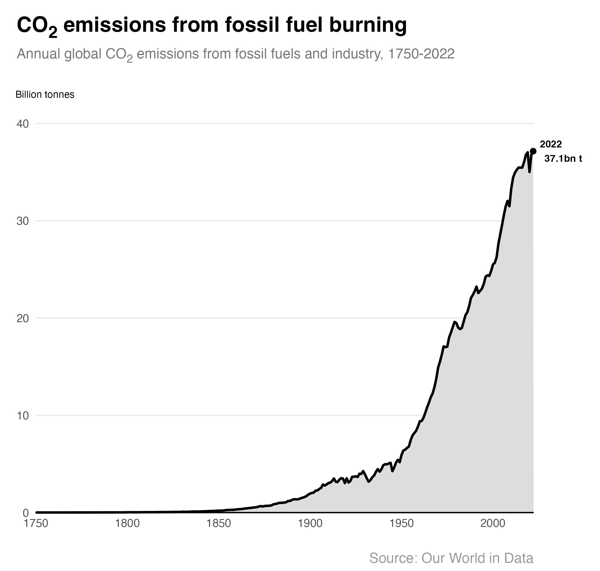

# Annual CO₂ emissions

Global CO2 emissions have grown sharply since the 1950s and now stand at 37 billion tonnes. Levels have slowed recently but not yet peaked.

The United Kingdom emitted 319 million tonnes of CO2 in 2022. This is a sharp fall from the 1971 peak when 660 million tonnes were emitted.

## Further reading
- Ritchie, H. & Roser, M. (January 2024) - *CO2 emissions*. Our World in Data. [https://ourworldindata.org/co2-emissions](https://ourworldindata.org/co2-emissions) 