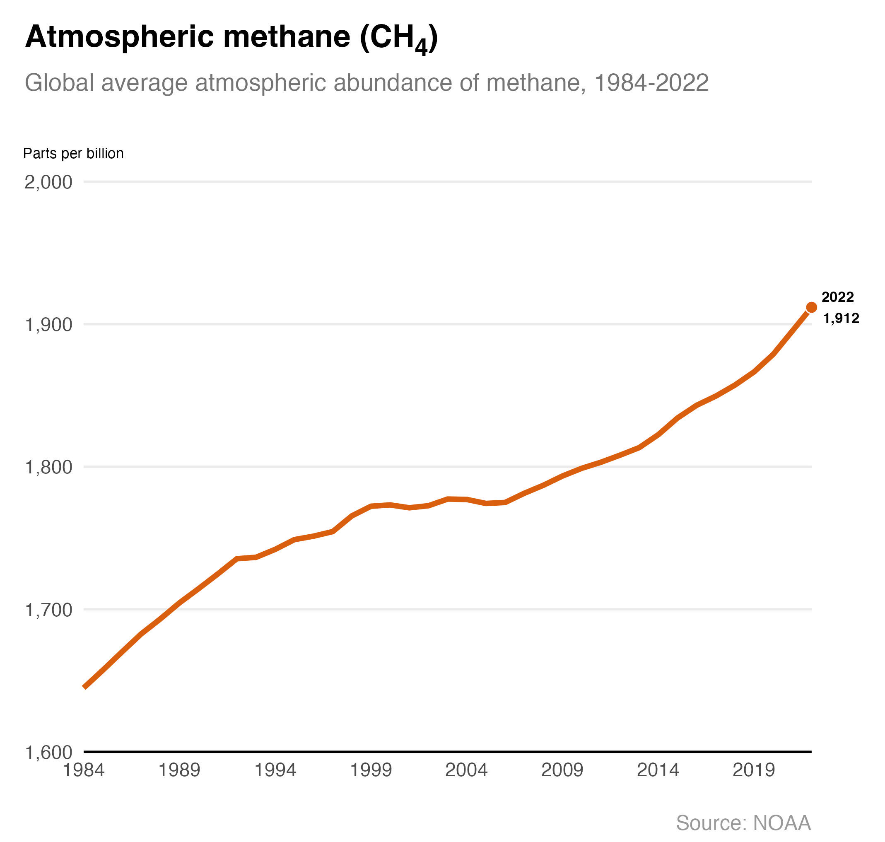

# Atmospheric methane

Atmospheric concentrations of methane (CH4) are at record levels. In 2022, around 1900 parts per billion were present in the atmosphere. 

Methane is one of the most potent greenhouse gases. Methane has 80 times greater global warming potential per tonne than carbon dioxide (CO2) over a 20-year period. However, unlike carbon dioxide it breaks down quickly and leaves the atmosphere relatively quickly. Over a longer 100-year period it traps around 28 times as much heat.

Methane is created by animal production, particularly cows and sheep, released by fracking, thawing permafrost and rotting organic matter at landfill sites.