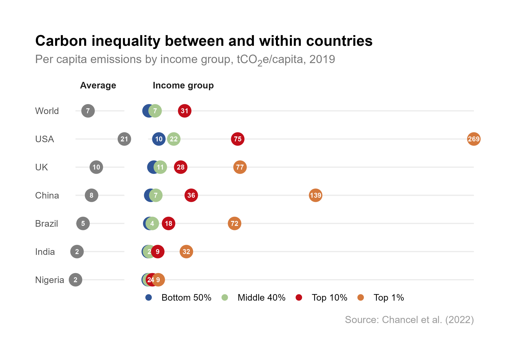

# Carbon inequality

Individual emissions are strongly linked to levels of income and wealth. The top 10% of people on the income distribution were responsible for 47.6% of global carbon emissions in 2019 (Chancel et al. 2022). Those in the bottom half of the income distribution emitted 12%.

The differences are equally stark *within* countries. In the United Kingdom, the average person emitted around 9.9 tonnes of CO2e in 2019. However, those in the top 1% emitted 76.6 tonnes on average whilst those in the bottom 50% emitted only 5.6 tCO2e.

### Further reading
- Chancel, L., Piketty, T., Saez, E., & Zucman, G. (Eds.). (2022). World inequality report. Harvard University Press. [https://wir2022.wid.world/](https://wir2022.wid.world/)
- Chancel, L. (2022). Global carbon inequality over 1990–2019. *Nature Sustainability*, 5(11), 931–938. [https://doi.org/10.1038/s41893-022-00955-z](https://doi.org/10.1038/s41893-022-00955-z)