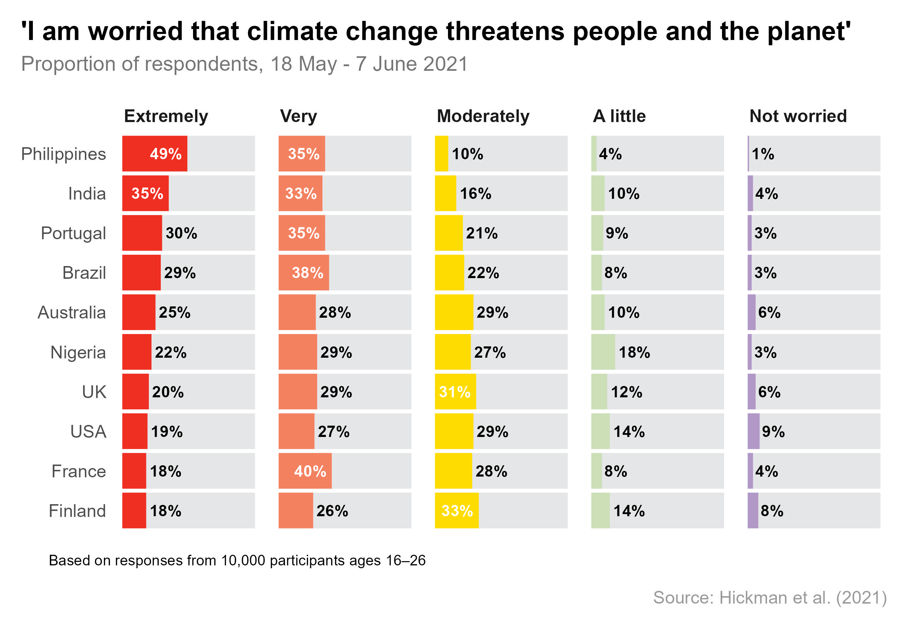

# Climate anxiety

10,000 young people (aged 16-25 years) from ten different countries were asked how worried they were about climate change (Hickman et al., 2021). 59% of respondents were 'extremely' or 'very' worried about climate change. However, respondents from countries in the Global South were more worried than peers from countries in the North. For example, 84% of young people from the Philippines and over two-thirds from India and Brazil were 'extremely' or 'very' worried compared with less than half from the UK, USA or Finland.

### Further reading
- Hickman, C., Marks, E., Pihkala, P., Clayton, S., Lewandowski, R. E., Mayall, E., Wray, B., Mellor, C., & Van Susteren, L. (2021). Climate anxiety in children and young people and their beliefs about government responses to climate change: a global survey. *The Lancet Planetary Health*, 5(12), e863–e873. [https://doi.org/10.1016/s2542-5196(21)00278-3](https://doi.org/10.1016/s2542-5196(21)00278-3)