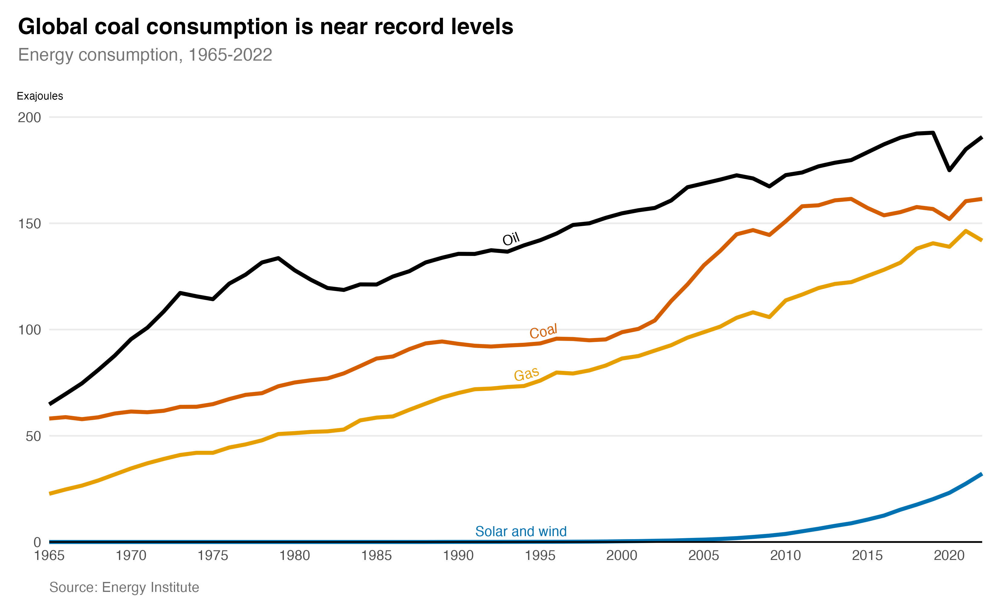

# Coal consumption

Annual global coal consumption reached its second highest level in 2022 at 161.5 exajoules. China (8,251 MtCO2), India (1,854 MtCO2) and the United States (935 MtCO2) are responsible for the largest coal-related carbon dioxide emissions in 2022 ([Global Carbon Project](https://globalcarbonatlas.org/emissions/carbon-emissions/)).