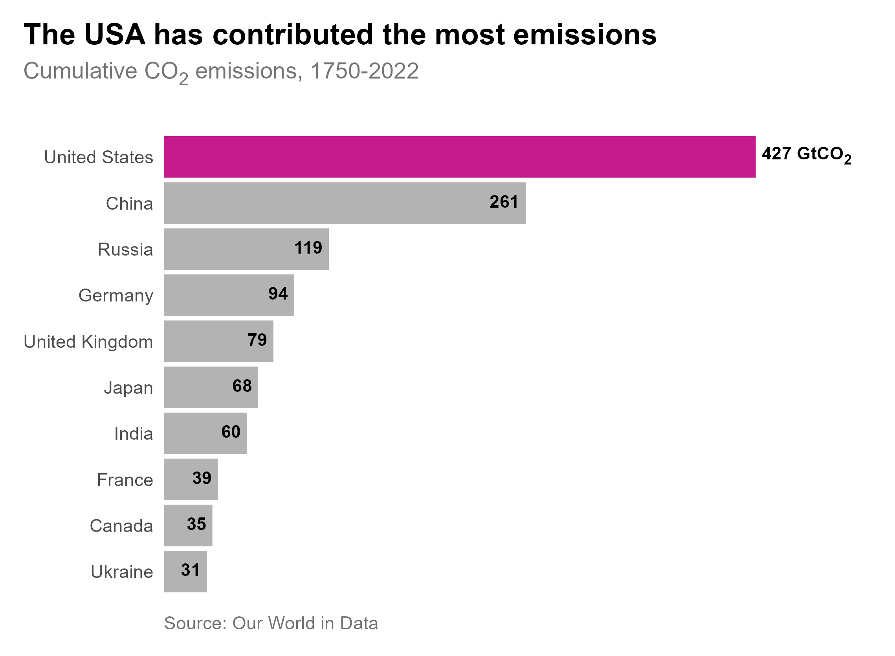

# Cumulative CO2 emissions, 2022

The United States was responsible for 427 billion tonnes of CO2 between 1750 and 2022 which is around 25% of historical emissions. China is the second largest contributor of cumulative CO2 emissions.

The United Kingdom was the first industrialised nation and has emitted 79 billion tonnes of CO2 into the atmosphere since 1750. This is equivalent to 4.5% of global cumulative CO2 emissions. 

This historical legacy of CO2 emissions is important because carbon dioxide stays in the atmosphere for [hundreds of years](https://climate.nasa.gov/news/2915/the-atmosphere-getting-a-handle-on-carbon-dioxide/).

## Further reading
- Evans, S. (5 October 2021). *Analysis: Which countries are historically responsible for climate change?*. Carbon Brief. [https://www.carbonbrief.org/analysis-which-countries-are-historically-responsible-for-climate-change/](https://www.carbonbrief.org/analysis-which-countries-are-historically-responsible-for-climate-change/)
- Ritchie, H. (1 October 2019). *Who has contributed most to global CO2 emissions?*. Our World in Data. [https://ourworldindata.org/contributed-most-global-co2](https://ourworldindata.org/contributed-most-global-co2)

