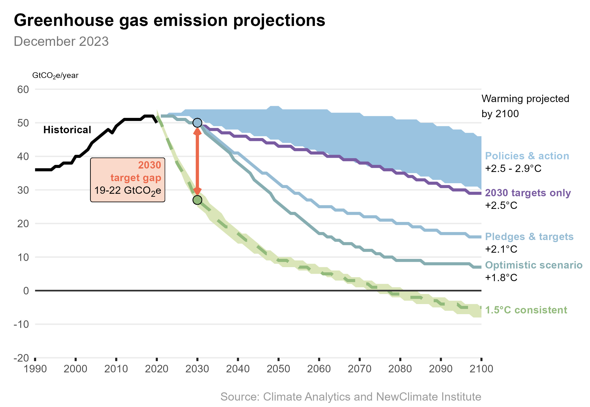

# Emissions gap

As of December 2023, current policies to respond to climate change are projected to result in about 2.7°C of warming by 2100 compared with pre-industrial levels. Global CO2 emissions need to be halved by 2030 to limit global average temperatures to 1.5°C above pre-industrial levels.

### Further reading
- Climate Action Tracker (2023). 2030 Emissions Gap: CAT projections and resulting emissions gap in meeting the 1.5°C Paris Agreement goal. December 2023. [https://climateactiontracker.org/global/cat-emissions-gaps/](https://climateactiontracker.org/global/cat-emissions-gaps/) 