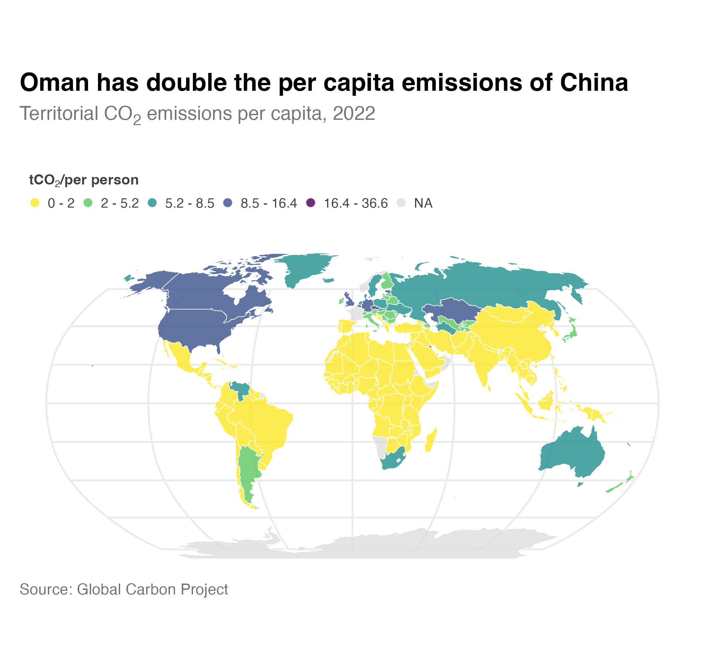

# Carbon dioxide emissions per capita, 2022

On average, 4.7 tons of CO₂ were emitted per person in 2022. However, this average masks wide variation between countries. Africa produced about 1 tonne of carbon dioxide emissions per person in 2022 whilst Qatar produced 37.6 tonnes per capita. Countries of the Global North typically have much higher per capita emissions than developing countries in the Global South. 

The United Kingdom emitted 4.7 tonnes of CO2 per person in 2022 which is the same as the global average. By comparison, residents of the United States emitted around 14.9 tonnes of CO2.

## Further Reading
- Ritchie, H., Rosado, P., and Roser M. (2023). *CO₂ and Greenhouse Gas Emissions*. Our World in Data. [https://ourworldindata.org/co2-and-greenhouse-gas-emissions](https://ourworldindata.org/co2-and-greenhouse-gas-emissions)