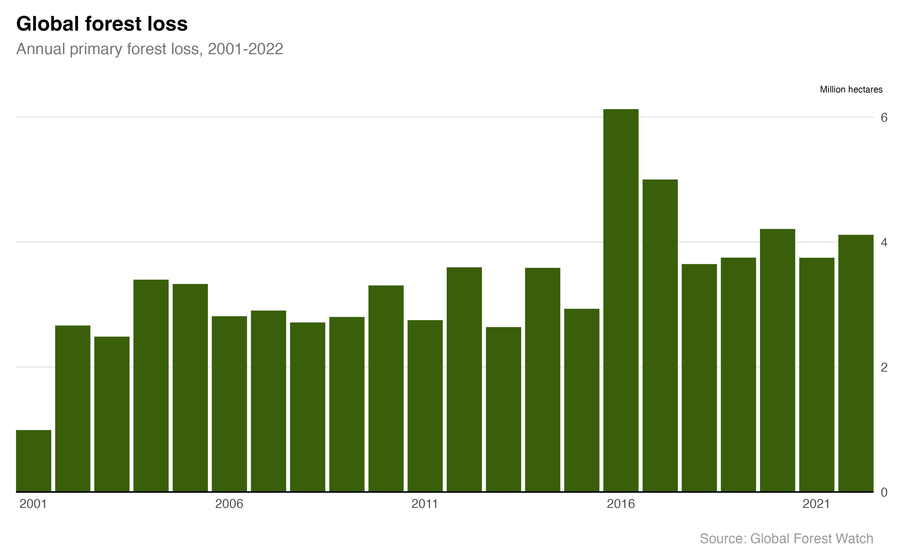

# Forest loss

Agriculture is the primary cause of deforestation. In the tropics, forests are cleared for palm and soy cultivation and for grazing beef cattle. Forests are also threatened by insects, diseases like [Ash dieback](https://www.forestresearch.gov.uk/tools-and-resources/fthr/pest-and-disease-resources/ash-dieback-hymenoscyphus-fraxineus/), drought and wildfires.

### Further reading
- Ritchie, H. (23 February 2021). *Cutting down forests: what are the drivers of deforestation?
*. Our World in Data. [https://ourworldindata.org/what-are-drivers-deforestation](https://ourworldindata.org/what-are-drivers-deforestation)