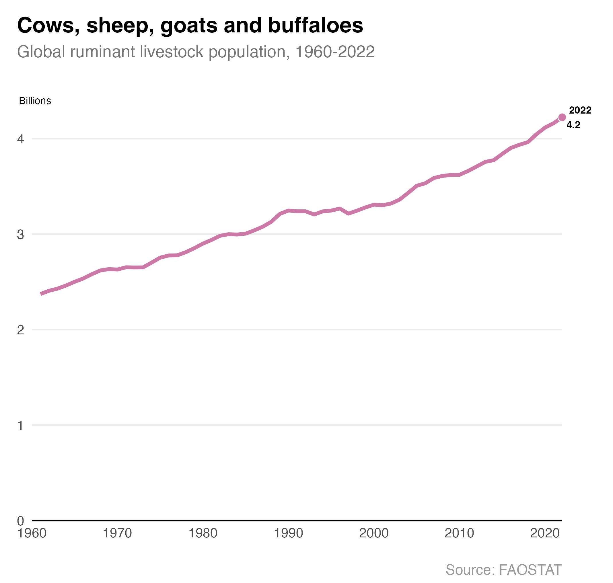

# Ruminant livestock

The number of ruminant livestock continues to grow each year as a result of rising demand for meat. Around a third of human-caused methane emissions come from ruminant livestock ([UN 2021](https://www.unep.org/news-and-stories/press-release/global-assessment-urgent-steps-must-be-taken-reduce-methane)). The digestion of grass creates methane in the stomachs of cows, sheep and other ruminant animals which is released in burps and manure.

Farming accounted for 12% of UK greenhouse gas emissions in 2022 ([DESNZ 2024](https://www.gov.uk/government/statistics/final-uk-greenhouse-gas-emissions-national-statistics-1990-to-2022)). 58% of these emissions come from the enteric fermentation (digestion processes) of ruminant livestock.

### Further reading
- Dimbleby, H. & Lewis, J. (2023). *Ravenous: How to get ourselves and our planet into shape.* Profile Books.  
