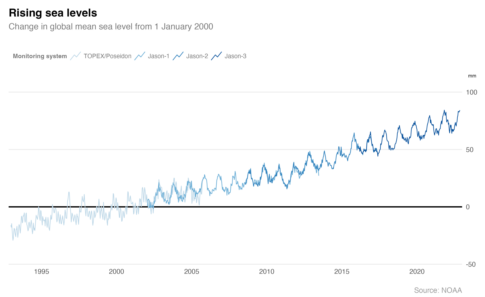

# Sea levels

Sea water level rises are caused by thermal expansion and melting ice sheets and glaciers that result from global warming. The global mean sea level has increased by about 21cm since 1900 ([EEA 2024](https://www.eea.europa.eu/en/analysis/indicators/global-and-european-sea-level-rise)) and a 63-102cm rise has been predicted by the end of the century under a very high emissions scenario (SSP5-8.5). However, the amount of sea level rise varies by region because of ocean currents, rising and falling land masses and gravitational effects.

Flooding and erosion are the main effects of sea level rise. For example, saltwater intrusion can damage agricultural land and erosion can cause infrastructure damage in coastal communities.

In the last 30 years (1993–2022) sea levels around the United Kingdom have risen by 11.4cm ([Met Office, 2022](https://rmets.onlinelibrary.wiley.com/doi/10.1002/joc.8167)). The Climate Change Committee estimates that more than 100,000 properties in England may be at risk from coastal erosion by the 2080s ([CCC, 2018](https://www.theccc.org.uk/2018/10/26/current-approach-to-protecting-englands-coastal-communities-from-flooding-and-erosion-not-fit-for-purpose-as-the-climate-changes/)).

### Further reading
- NOAA Tides and Current. *Relative Sea Level Trends*. NOAA. [https://tidesandcurrents.noaa.gov/sltrends/](https://tidesandcurrents.noaa.gov/sltrends/).