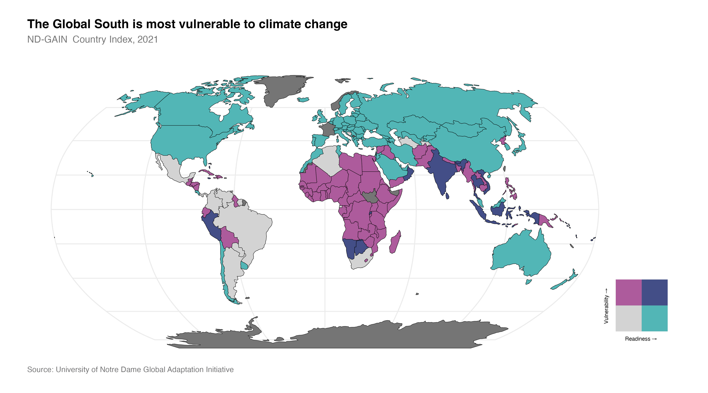

# Vulnerability and readiness

The University of Notre Dame's [Global Adaptation Initiative’s (ND-GAIN) Country Index](https://gain.nd.edu/) ranks 185 countries by their vulnerability and readiness to adapt to climate change.  Countries in purple are the most vulnerable to climate change and the least ready to adapt to it. These countries tend to sit near the equator and mostly located in Africa. However, some countries such as India, Vietnam and Rwanda are also vulnerable but have a high level of readiness to respond. Countries in teal are the least vulnerable and best prepared to respond to climate change. These tend to be developed countries in the northern hemisphere.

The United Kingdom is the 181st most vulnerable country and the 15th most ready country.

## Further reading

- Robinson, M. (2018). *Climate Justice: Hope, Resilience and the Fight for a Sustainable Future*.
